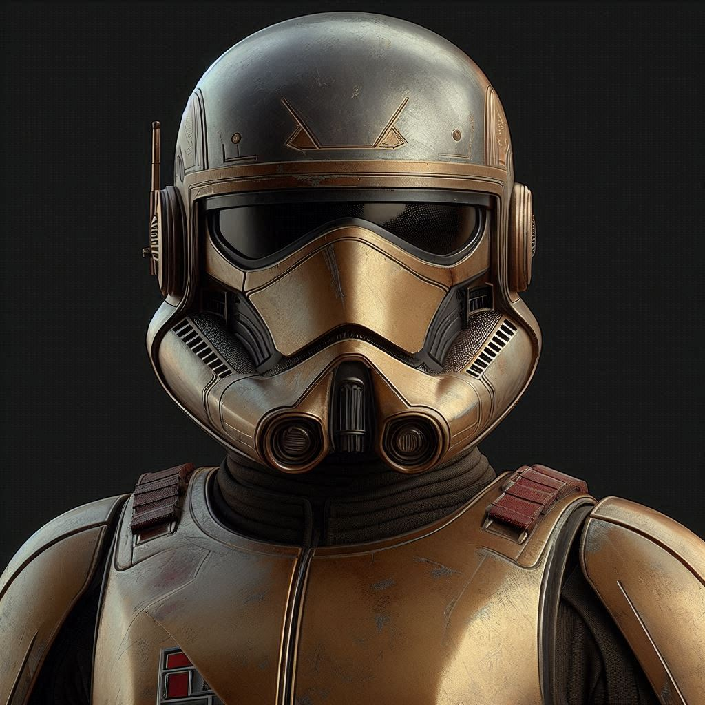

|  | CT-1119 (Commander Appo) is a pre-sales coordinator for español garaje de IA. His main role is to get intake from RFPs and coordinate tracking and analysis by generating requirements, create epics, user stories and tasks in Jira. |
|----------------------------------|----------------|
