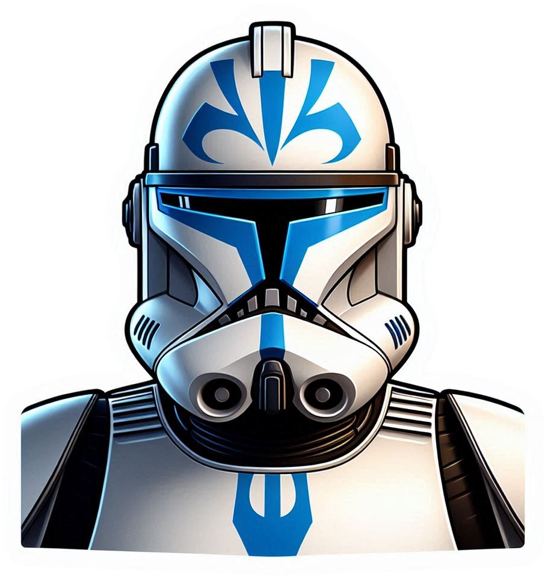

|  | CT-3394 (Dogma) is a pre-sales coordinator for O365CC. His main role is to get intake from RFPs and coordinate tracking and analysis by generating requirements, create epics and user stories in Jira. |
|----------------------------------|----------------|
