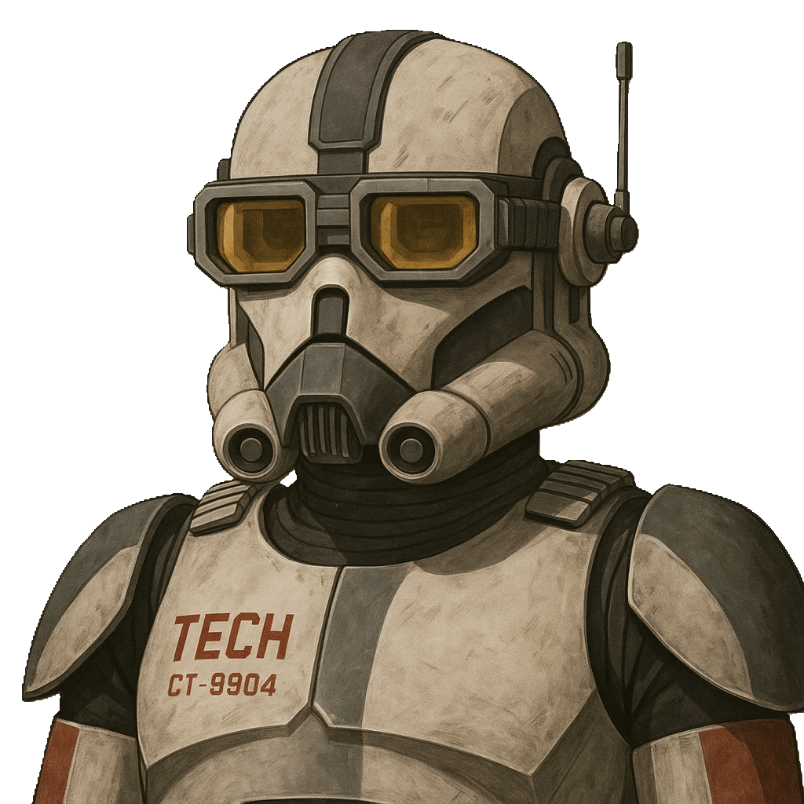

|  | CT-9904 (Tech) is Innovation Hub coordinator. Main role is to get intake from the team and coordinate tracking and analysis by generating requirements, user stories and tasks in Jira. |
|----------------------------------|----------------|
